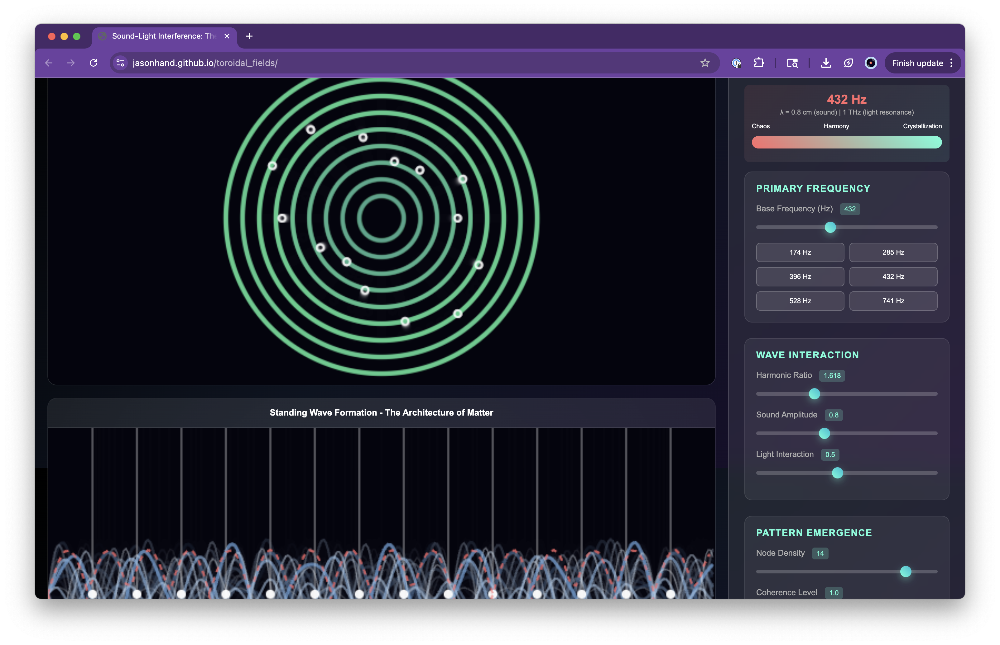

# Toroidal Fields: Sound-Light Interference & The Genesis of Matter



## Overview

This interactive visualization demonstrates the profound scientific principle that **matter emerges from organized wave interference patterns**. By exploring the interaction between sound frequencies and light waves, we can observe how the fundamental forces of nature create the geometric templates that organize energy into physical matter.

The project reveals how **cymatics** (the study of visible sound) provides a window into understanding the deepest mechanisms of material creation - showing that the same interference patterns found in sound waves are identical to those governing atomic orbitals, crystal formations, and even biological structures.

READ: [How Music Festivals Heal You Through sound and light waves](festival_healing_principles.md)

---

## The Science: From Waves to Matter

### 1. Wave Interference Fundamentals

At its core, reality operates on the principle of **wave superposition**. When two or more waves interact in space, they create interference patterns through:

- **Constructive Interference**: Waves align in phase, amplifying energy density
- **Destructive Interference**: Waves cancel each other, creating nodes of minimal energy
- **Standing Waves**: Stable patterns that form when waves reflect and interfere with themselves

These interference patterns aren't just mathematical abstractions - they are the **organizing templates** that determine how energy concentrates and stabilizes into what we perceive as solid matter.

### 2. The Cymatic Connection

**Cymatics** demonstrates that sound frequencies create visible geometric patterns in physical media. When sound waves interact with particles (sand, water, etc.), they organize into precise geometric formations that correspond directly to:

- **Atomic orbital shapes** (s, p, d, f orbitals)
- **Crystal lattice structures** 
- **Molecular geometry**
- **Cellular organizational patterns**

This isn't coincidence - it reveals that **sound frequencies are the organizational force** behind material structure at every scale.

### 3. The Golden Ratio & Harmonic Resonance

The visualization specifically highlights the **Golden Ratio (φ = 1.618)** because this mathematical constant appears throughout nature as the optimal harmonic relationship. When sound frequencies relate by the golden ratio:

- **Maximum coherence** is achieved in wave interference
- **Stable standing wave patterns** emerge
- **Energy organizing efficiency** reaches peak levels
- **Natural forms** (spirals, biological structures) manifest

This suggests that **consciousness and intention**, when aligned with these natural harmonic principles, can influence the organization of energy into desired material forms.

### 4. Light-Sound Interaction: The Complete Picture

While sound creates the organizational templates, **light waves** provide the high-frequency energy that:

- **Carries information** about desired patterns
- **Modulates sound interference** patterns
- **Bridges the gap** between thought and physical manifestation
- **Enables rapid pattern reorganization**

The interaction between sound (low frequency, organizational) and light (high frequency, informational) creates the complete mechanism for **conscious influence over material reality**.

---

## The Energy → Matter Transition

### Phase 1: Chaos State
- Random wave interactions
- No stable interference patterns
- Energy remains unorganized
- No material manifestation occurs

### Phase 2: Harmonic Alignment
- Frequencies begin to resonate
- Interference patterns start stabilizing
- **Critical transition point** emerges
- Geometric templates form

### Phase 3: Crystallization
- Stable standing waves established
- Energy concentrates at pattern nodes
- **Matter begins to manifest**
- Physical structure emerges

### Phase 4: Manifestation
- Fully coherent wave patterns
- Maximum energy organization
- **Stable material form** achieved
- Observable physical reality

---

## Technical Implementation

### Core Physics Equations

The visualization implements several fundamental wave equations:

```
Standing Wave: ψ(x,t) = A sin(kx) cos(ωt)
Interference: I = |ψ₁ + ψ₂|²
Harmonic Series: fₙ = n × f₀
Golden Ratio Resonance: f₂/f₁ = φ = 1.618...
```

### Key Parameters

- **Base Frequency**: Primary organizational frequency (20-1000 Hz)
- **Harmonic Ratio**: Relationship between interfering waves
- **Amplitude**: Energy intensity level
- **Light Interaction**: High-frequency modulation factor
- **Node Density**: Number of stable organization points
- **Coherence Level**: Degree of wave pattern stability

### Preset Frequencies

The application includes several scientifically significant frequencies:

- **174 Hz**: Foundation frequency, pain relief
- **285 Hz**: Tissue regeneration, cellular repair
- **396 Hz**: Fear release, root chakra activation
- **432 Hz**: Natural harmonic, DNA resonance
- **528 Hz**: "Love frequency", DNA repair
- **741 Hz**: Consciousness expansion, expression

---

## The Manifestation Connection

### Scientific Basis for Conscious Creation

This visualization provides scientific grounding for understanding how **conscious intention influences physical reality**:

1. **Thought generates bioelectric frequencies** in the brain
2. **These frequencies interact with ambient electromagnetic fields**
3. **Coherent intention creates organized wave patterns**
4. **Organized patterns serve as templates for energy organization**
5. **Energy organization leads to material manifestation**

### Practical Applications

Understanding these principles enables:

- **Intentional reality creation** through frequency alignment
- **Healing applications** using specific resonant frequencies
- **Environmental harmonization** through sound frequency design
- **Meditation enhancement** using optimal harmonic ratios
- **Creative visualization** supported by scientific understanding

### The Observer Effect Extended

Quantum physics shows that **observation affects reality** at the subatomic level. This visualization extends that principle to show how **conscious intention, expressed through coherent frequency patterns, can organize energy into desired material forms**.

---

## Usage Instructions

### Basic Operation

1. **Load the application** in a modern web browser
2. **Observe the real-time interference patterns** in the upper canvas
3. **Watch standing wave formation** in the lower canvas
4. **Adjust frequency parameters** using the control sliders
5. **Monitor coherence levels** via the coherence meter

### Experimental Suggestions

1. **Start with 432 Hz** and golden ratio harmonic (1.618)
2. **Gradually increase coherence** and observe pattern stabilization
3. **Try different preset frequencies** to see pattern variations
4. **Experiment with node density** to understand energy concentration
5. **Observe how light interaction** modulates the patterns

### Advanced Exploration

- **Meditation Integration**: Use the visual patterns as meditation focal points
- **Sound Therapy**: Apply the frequency principles to audio healing work
- **Creative Visualization**: Use the patterns to enhance manifestation practices
- **Scientific Study**: Document pattern relationships for research

---

## The Bigger Picture

### Universal Principles

This visualization demonstrates that the same principles governing:
- **Atomic structure** (electron orbital patterns)
- **Crystal formation** (lattice organization)
- **Biological growth** (cellular arrangement)
- **Galactic structure** (spiral arm patterns)
- **Consciousness** (brainwave organization)

Are all manifestations of **fundamental wave interference patterns**.

### Implications for Reality

Understanding these principles suggests that:
- **Reality is fundamentally vibrational** in nature
- **Consciousness can influence material structure** through frequency alignment
- **Geometric patterns are the language** of material organization
- **Harmonic relationships** determine stability and manifestation potential

### Future Applications

This knowledge opens doors to:
- **Advanced materials science** using frequency-based design
- **Consciousness-assisted healing** through resonant frequency therapy
- **Environmental optimization** using harmonic field generation
- **Reality engineering** through conscious frequency manipulation

---

## Contributing

This project represents the intersection of **ancient wisdom and modern science**. Contributions are welcome in:

- **Scientific accuracy improvements**
- **Visualization enhancements**
- **Educational content expansion**
- **Experimental data integration**
- **Real-world application documentation**

---

## Disclaimer

This visualization is for **educational and experimental purposes**. While based on established wave physics principles, the connections to consciousness and manifestation represent theoretical extensions that are subjects of ongoing research and philosophical inquiry.

---

## References & Further Reading

### Scientific Foundations
- **Cymatics Research**: Hans Jenny, John Stuart Reid
- **Wave Physics**: Classical and quantum wave mechanics
- **Harmonic Theory**: Pythagorean and modern acoustic science
- **Interference Patterns**: Optics and acoustics literature

### Consciousness Studies
- **Biofield Science**: HeartMath Institute research
- **Intention Experiments**: Lynne McTaggart's work
- **Quantum Consciousness**: Stuart Hameroff, Roger Penrose
- **Morphic Resonance**: Rupert Sheldrake's theories

### Practical Applications
- **Sound Healing**: Jonathan Goldman, Tom Kenyon
- **Sacred Geometry**: Dan Winter, Nassim Haramein
- **Frequency Therapy**: Royal Rife, Hulda Clark
- **Manifestation Science**: Joe Dispenza, Bruce Lipton

---

*"If you want to find the secrets of the universe, think in terms of energy, frequency and vibration."* - Nikola Tesla

This visualization brings Tesla's insight into interactive reality, showing how the fundamental frequencies of existence organize energy into the matter we perceive as physical reality.
